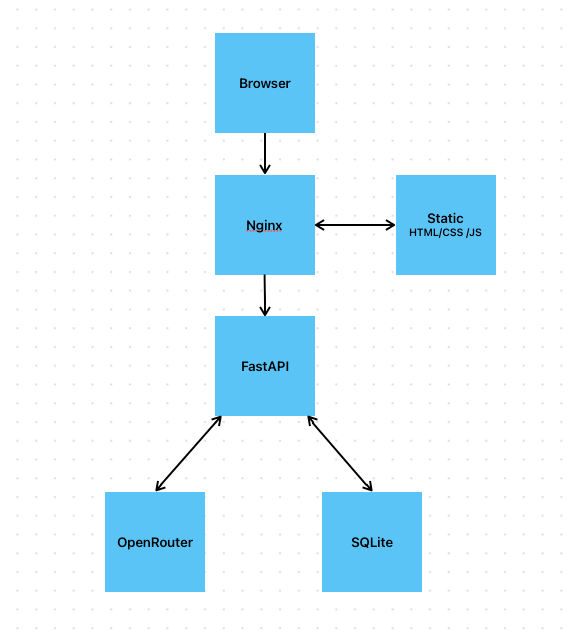
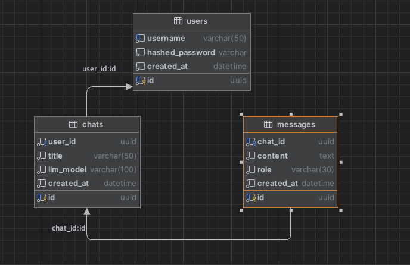
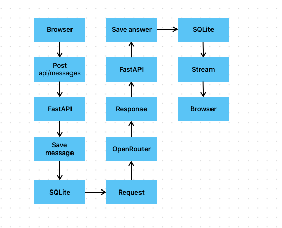

# AI Chat

## О проекте
Проект разработан в рамках тестового задания.

Реализовано веб-приложение, позволяющее пользователям:
- зарегистрироваться и авторизоваться;
- создавать, переименовывать и удалять чаты;
- отправлять сообщения языковой модели;
- получать ответы в потоковом режиме (streaming);
- хранить историю переписки между сессиями.

Backend реализован на FastAPI, фронтенд — на HTML/CSS/JavaScript без использования фреймворков. В качестве базы данных используется SQLite. Взаимодействие с LLM осуществляется через OpenRouter API. Nginx используется для раздачи статических файлов и проксирования запросов к backend.

---

## Технологии

### Backend
- Python 3.13
- FastAPI
- SQLAlchemy
- SQLite
- Alembic
- JWT Authentication
- OpenRouter API

### Frontend
- HTML
- CSS
- JavaScript

### Infrastructure
- Docker
- Docker Compose
- Nginx

---

## Архитектура проекта

---

## Структура проекта

- backend/
- frontend/
- docker-compose.yml
- README.md

---

## Инструкция по запуску

1. Выполняем `git clone https://github.com/AlexandrSmolyachkovGH/test-5elem.git`;
2. Переходим в проект `cd test-5elem`;
3. Регистрируемся в https://openrouter.ai/ и сохраняем локально API ключ;
4. Создаем .env файл `cp .env.example .env` и добавляем в него API ключ из прошлого пункта в переменную `LLM_API_KEY`;
5. Билдим проект `docker compose build && docker compose up -d`;
6. В браузере открываем http://localhost.

---

## Миграции

В проект закинута тестовая база с уже примененными к ней миграциями. Дополнительные действия не требуются.

---
## Схема БД

---

## Диаграмма последовательности

